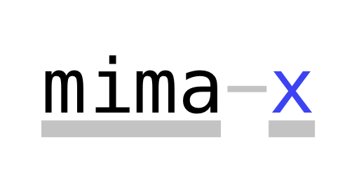

> **WIP**: Some features are somewhat unfinished and potentially buggy.

Dies ist ein VM für die "mima" und "mima-x" Architekturen aus den GBI und RO Vorlesungen des KIT.

Die VM ist in [Nim](https://nim-lang.org) geschrieben. Da Nim sowohl C/C++ als auch JavaScript als compile target haben kann ist es leicht möglich verschiedene frontends für die VM bauen. Es wird *irgendwann vielleicht* eine Webversion geben, welche einem erlaubt MIMA assembly einzugeben, dieses auszuführen und dabei den Zustand der VM zu untersuchen.

## Compilen

Man kann den aktuellsten [Release](https://github.com/JannikWibker/mimax-vm/releases) nutzen oder das Programm selber compilen.
Zum compilen braucht man [nim](https://nim-lang.org/install.html).

```sh
nimble build
./mimax
```

## Benutzung

```
usage: mimax <optional flags> <file>

flags:
  -b, --bin           Use binary representation as input
  -c, --compile       Compile to binary representation
  -v, --version       Print version
  -d, --debug         Enable debugging features (breakpoints, stepping through code, ...)
  -D, --disassemble   Disassemble binary representation
  -A, --alt-mima      Use slightly different mima instruction set
```

> Falls nur ein Dateiname (und optional `-b`) angegeben wird, wird die Datei ausgeführt.

### Disassemble

Man kann eine Binärdatei mit der `-D`-flag disassemblen.

Da in der Binärdatei keine Labels abgespeichert werden wird nach allen Instruktionen die ein Label nutzen gesucht und die gefundene Addresse (Dezimal) als Label dargestellt.

```sh
./mimax -D test.bin.mimax
0x000000           LDC 7
0x000001           CALL 3
0x000002           HALT
0x000003 3       : STVR 0 (SP)
0x000004           LDSP
0x000005           ADC 1
0x000006           STSP
0x000007           RET
0x000008           LDSP
0x000009           ADC -1
0x00000A           STSP
0x00000B           RET
0x00000C           LDVR -1 (SP)
0x00000D           RET
```

> Die `test.bin.mimax`-Datei ist eine Binärversion von `test.mimax`


### Debugging

Es gibt einen Debugger mit welchem man Stück für Stück durch ein Programm durch-steppen kann; den Zustand betrachten kann und vieles mehr.

```
./mimax -d test.mimax
use "h" for help
> h
The following commands are available:
h,  help                                   |  show this help menu
q,  quit, exit                             |  quit (^C also works)
i,  info                                   |  show state of vm
it, infotoggle                             |  toggle details
d,  dis                                    |  disassemble the program

s,  step     <steps: uint>                 |  step specified amount
s,  step                                   |  alias of step 1
st, stepto <address: uint>                 |  step to address
e,  exec                                   |  execute until a breakpoint is hit or the vm halts

b,  break    <address: uint>               |  set breakpoint at address
br, breakrel   <offset: int>               |  set breakpoint relative from current location
m,  mem <address: uint>                    |  inspect memory at address
m,  mem <address: uint> = <value: int>     |  update memory at address
r,  reg <register: string>                 |  inspect specified register
r,  reg <register: string> = <value: int>  |  update specified register
rs, reset                                  |  reset the state of the vm
```

### Compile

Hier werden die Assembly instruktionen aus einer Textdatei in eine Binärdatei umgewandelt.

Die Binärdatei wird `<input filename>.bin` heißen.

## Mima-X

### Beispielcode

Programme können entweder als Binärdatei oder als Textdatei ausgeführt werden. Für Binärdateien muss die `-b`-flag benutzt werden (`-D`-nutzt auch Binärdateien)

```x86
        ldc 7
        call %push
        halt
        
push:   stvr 0 (sp)   ; this pushes the value of the accumulator to the stack
        ldsp
        adc 1
        stsp
        ret

pop:    ldsp          ; this pops the top-most value of the stack
        adc -1
        stsp
        ret

top:    ldvr -1 (sp)  ; this loads the top-most value of the stack into the accumulator
        ret
```

Am besten erstellt man eine Binärdatei direkt mit mimax mit der `-c`-flag (compile).

Ansonsten kann man auch selber Binärdateien mit einem Hexeditor erstellen, nur muss man dabei immer sehr viel aufpassen keine Fehler zu machen. Was einigermaßen gut funktioniert ist eine Kombination aus [xxd](https://linux.die.net/man/1/xxd) und einem Editor:

1. `cat file.bin > xxd > file` um ein hexdump einer vorhandenen Datei zu erhalten
2. Datei mit Editor der Wahl editieren
3. `cat file > xxd -r > file.bin` um xxd zu sagen, dass er den hexdump wieder in eine Binärdatei umwandeln soll

Alternativ in vim: `:%!xxd` und dann `:%!xxd -r`

Was wichtig bei selbsterstellten Binärdateien ist, ist dass sie den korrekten Header haben, sie müssen mit `mimax\0` starten (das ist ein Nullterminator am Ende).

### Instructions

Die Mima-X Instructions sind zum größtenteil einfach Mima Instructions, aber es gibt einige neue, die die Mima vorher nicht hatte.

Alte Instructions:
- LDC: `a = arg`
- LDV: `a = mem[arg]`
- STV: `mem[arg] = a`
- LDIV: `a = mem[mem[arg]]`
- STIV: `mem[mem[arg]] = a`
- ADD: `a = a + mem[arg]`
- AND: `a = a & mem[arg]`
- OR: `a = a | mem[arg]`
- XOR: `a = a ^ mem[arg]`
- NOT: `a = ~a`
- RAR: ` = a >> 1 (no zero-fill)`
- EQL: `a = a == mem[arg] ? R1 : 0`
- JMP: `iar = arg`
- JMN: `iar = a == R1 ? mem[arg] : iar`
- HALT: `halt`

Neue Instructions:
- CALL: `ra = iar; iar = arg`
- RET: `iar = ra`
- LDVR: `a = mem[memp[reg] + arg] (Syntax: `LDVR <arg> (<reg>)`)`
- STVR: `mem[mem[reg] + arg] = a (Syntax: `STVR <arg> (<reg>)`)`
- LDSP: `a = sp`
- STSP: `sp = a`
- ADC: `a = a + arg`


### Register

- IR: Instruction Register
- RA: Return Address
- IAR: Instruction Address Register (PC)
- A: Accumulator
- 1: One (filled with all 1's)
- SP: Stack Pointer
- FP: Frame Pointer (callstack)
- SAR: Storage Address Register
- SDR: Storage Data Register
- X: X Register (ALU)
- Y: Y Register (ALU)

### Opcodes

> Opcodes für alle Instructions die Argumente haben

| opcode | mnemonic |
| ------ | -------- |
| `0x00` |   LDC    |
| `0x01` |   LDV    |
| `0x02` |   STV    |
| `0x03` |   ADD    |
| `0x04` |   AND    |
| `0x05` |   OR     |
| `0x06` |   XOR    |
| `0x07` |   EQL    |
| `0x08` |   JMP    |
| `0x09` |   JMN    |
| `0x0a` |   LDIV   |
| `0x0b` |   STIV   |
| `0x0c` |  *CALL*  |
| `0x0d` |  *ADC*   |
| `0x0e` | *extended opcodes 2* |
| `0x0f` | extended opcodes 1 |

Alle Instructions ohne Argumente teilen sich einen "*Präfix*" (`0x0f`). Der Präfix weißt also auf einen sogenannten "**extended OP-Code**" hin. Zudem gibt es noch die Instructions mit dem Präfix `0x0e`, welche die verschiedenen Versionen von `LDVR` und `STVR` sind

> Opcodes für alle Instructions ohne Argumente (incl. Präfix)

| opcode | mnemonic |
| ------ | -------- |
| `0xf0` |   HALT   |
| `0xf1` |   NOT    |
| `0xf2` |   RAR    |
| `0xf3` |  *RET*   |
| `0xf4` |  *LDSP*  |
| `0xf5` |  *STSP*  |
| `0xf6` |  *LDFP*  |
| `0xf7` |  *STFP*  |
| `0xf8` |  *LDRA*  |
| `0xf9` |  *STRA*  |
|  ...   |    -     |

> Opcodes für alle Varianten von `LDVR` und `STVR`

| opcode | mnemonic    |
| ------ | ----------- |
| `0xe0` |  *LDVR*\*   |
| `0xe1` |     -       |
| `0xe2` |     -       |
| `0xe3` |     -       |
| `0xe4` |     -       |
| `0xe5` | *LDVR (RA)* |
| `0xe6` | *LDVR (SP)* |
| `0xe7` | *LDVR (FP)* |
| `0xe8` |  *STVR*\*   |
| `0xe9` |     -       |
| `0xea` |     -       |
| `0xeb` |     -       |
| `0xec` |     -       |
| `0xed` | *STVR (RA)* |
| `0xee` | *STVR (SP)* |
| `0xef` | *STVR (FP)* |

**\***: Intern benötigter Befehl, welcher aber nicht normal verwendbar ist, trotzdem gibt es, bzw. genau deshalb gibt es, einen zugeordneten Opcode.

> Die "offizielen" opcodes für sind normal geschrieben, die "inoffiziellen" in *kursiv*. Es gibt für viele Befehle Opcodes, aber nicht unbedingt für alle, für diese wurde dann ein sinnvoller Wert gewählt.
